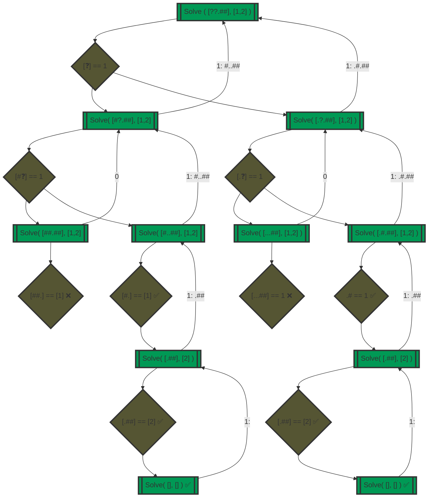

# Day 12: Hot Springs

## Input
Many of the springs have fallen into disrepair. Their condition records of which springs are damaged (your puzzle input) are also damaged! You'll need to help them repair the damaged records.

In the giant field just outside, the springs are arranged into rows. For each row, the condition records show every spring and whether it is operational (.) or damaged (#). This is the part of the condition records that is itself damaged; for some springs, it is simply unknown (?) whether the spring is operational or damaged.

However, the engineer that produced the condition records also duplicated some of this information in a different format! After the list of springs for a given row, the size of each contiguous group of damaged springs is listed in the order those groups appear in the row. This list always accounts for every damaged spring, and each number is the entire size of its contiguous group (that is, groups are always separated by at least one operational spring: #### would always be 4, never 2,2).

However, the condition records are partially damaged; some of the springs' conditions are actually unknown (?). For example:
```
???.### 1,1,3
.??..??...?##. 1,1,3
?#?#?#?#?#?#?#? 1,3,1,6
????.#...#... 4,1,1
????.######..#####. 1,6,5
?###???????? 3,2,1
```
## Part 1
Equipped with this information, it is your job to figure out how many different arrangements of operational and broken springs fit the given criteria in each row

For each row, count all the different arrangements of operational and broken springs that meet the given criteria. What is the sum of those counts?
```
"???.###" <=> [1, 1, 3] => 1 combination
"#.#.###"

".??..??...?##." <=> [1, 1, 3] => 4 combinations
".#...#....###."
".#....#...###."
"..#..#....###."
"..#...#...###."

"?#?#?#?#?#?#?#?" <=> [1, 3, 1, 6] => 1 combination
".#.###.#.######"

"????.#...#..." <=> [4, 1, 1] => 1 combination
"####.#...#..."

"????.######..#####." <=> [1, 6, 5] => 4 combinations
"#....######..#####."
".#...######..#####."
"..#..######..#####."
"...#.######..#####."

"?###????????" <=> [3, 2, 1] => 10 combinations 
".###.##.#..."
".###.##..#.."
".###.##...#."
".###.##....#"
".###..##.#.."
".###..##..#."
".###..##...#"
".###...##.#."
".###...##..#"
".###....##.#"

Total combinations = 21
```
## Part 2
replace the list of spring conditions with five copies of itself (separated by ?) and replace the list of contiguous groups of damaged springs with five copies of itself (separated by ,).
So, this row:
```
.# 1
```
Would become:

```
.#?.#?.#?.#?.# 1,1,1,1,1
```
Unfold your condition records; what is the new sum of possible arrangement counts?

```
     1 = "???.###????.###????.###????.###????.###" <=> [1, 1, 3, 1, 1, 3, 1, 1, 3, 1, 1, 3, 1, 1, 3]
 16384 = ".??..??...?##.?.??..??...?##.?.??..??...?##.?.??..??...?##.?.??..??...?##." <=> [1, 1, 3, 1, 1, 3, 1, 1, 3, 1, 1, 3, 1, 1, 3]
     1 = "?#?#?#?#?#?#?#???#?#?#?#?#?#?#???#?#?#?#?#?#?#???#?#?#?#?#?#?#???#?#?#?#?#?#?#?" <=> [1, 3, 1, 6, 1, 3, 1, 6, 1, 3, 1, 6, 1, 3, 1, 6, 1, 3, 1, 6]
    16 = "????.#...#...?????.#...#...?????.#...#...?????.#...#...?????.#...#..." <=> [4, 1, 1, 4, 1, 1, 4, 1, 1, 4, 1, 1, 4, 1, 1]
  2500 = "????.######..#####.?????.######..#####.?????.######..#####.?????.######..#####.?????.######..#####." <=> [1, 6, 5, 1, 6, 5, 1, 6, 5, 1, 6, 5, 1, 6, 5]
506250 = "?###??????????###??????????###??????????###??????????###????????" <=> [3, 2, 1, 3, 2, 1, 3, 2, 1, 3, 2, 1, 3, 2, 1]
========
525152
```
## Approach
### Part 1
We are looking at the problem in the following way
```
`Hash` rec     `Num` rec     `Hash` rec        `Num` rec
 ===========    ==========    ===========       =============
 "###.#.#" <=> [3, 1, 1]  as  [###], [#], [#] <=> [3], [1], [1]
```
Therefore, a solution to the problem looks like a **sequence**:
```
[###] == [3] -> [#] == [1] -> [#] == [1]

With a Valid combination expressed as the
SUM( [Hash rec] == [Num rec] ) == TRUE 
from 1..n 
where `n` == total `Num` records
```
In a case where a damaged record `?` is present, we need to evaluate the both  `.` and `#` cases for **valid combinations**. For example,
```text
[??] == 1 ❓
[..] == 1 ❌
[#.] == 1 ✅
[.#] == 1 ✅
[##] == 1 ❌
```
In line to the above, we implement a function `Solve()` with parameters `Hash_rec[]` and `Num_rec[]` that returns either `1` or `0` for valid or invalid combination respectively.
The function will
1. aim to match the first `Hash_rec` pattern occurrence against the first `Num rec` value, e.g. `[#.] == [1]`
   1. If we find a match then we process to find the next record in sequence,hence we call `Solve()` (recurse) again by passing the * **remaining** * of `Hash_rec[]` and `Num_rec[]`. If we cannot get a match then we just return `0` 
2. if we have stepped onto a `?` during parsing of the string then we 
   1. replace `?` -> `#` and call `Solve()` (recurse) with (a) same `Num_rec` and (b) Hash_rec[] as parsed + remaining
   2. replace `?` -> `.` and call `Solve()` (recurse) with (a) same `Num_rec` and (b) Hash_rec[] as parsed + remaining
   3. Then we return the `SUM` of the values returned by the above calls
3. if the function is called with 
   1. empty `Num_rec[]` array and with a `Hash_rec[]` that is either (a) empty or (b) contains no trailing `#`, then we have found a **valid combination**
   2. empty `Hash_rec[]` array but not the `Num_rec[]`, then we have ended up with an **invalid combination** 

The above recursive logic is also depicted in the below graph

### Part 2
Having to repeat each hash & num record by 5 times, we put ourselves in a situation where we are **solving again and again a very large number of sub-problems**. 

By looking at the above grah diagram we see that
1. `([##.##],[1,2])` sub-problem has a solution `0` and is solved once
2. `([.##],[2])` sub-problem has a solution `1` and has been solved **twice**

Therefore, we use the **memoization technique**, hence storing each solution to a sub-problem and reuse the solution when the same sub-problem re-appears, hence saving us the re-calculation.

Hence, we use a 'HashMap' with `(key,value) == (([has_rec],[num_rec]), combinations)` we should avoid recomputing sub-problems already solved hence speeding up dramatically the overall calculations.

Hence `Solve()` is slightly altered to to 
1. ask for a known solution before any processing takes place and only process to calculation if such input hasn't been solved before
2. store the solution returned from the recursion when a current Hash pattern matched the current Num record
