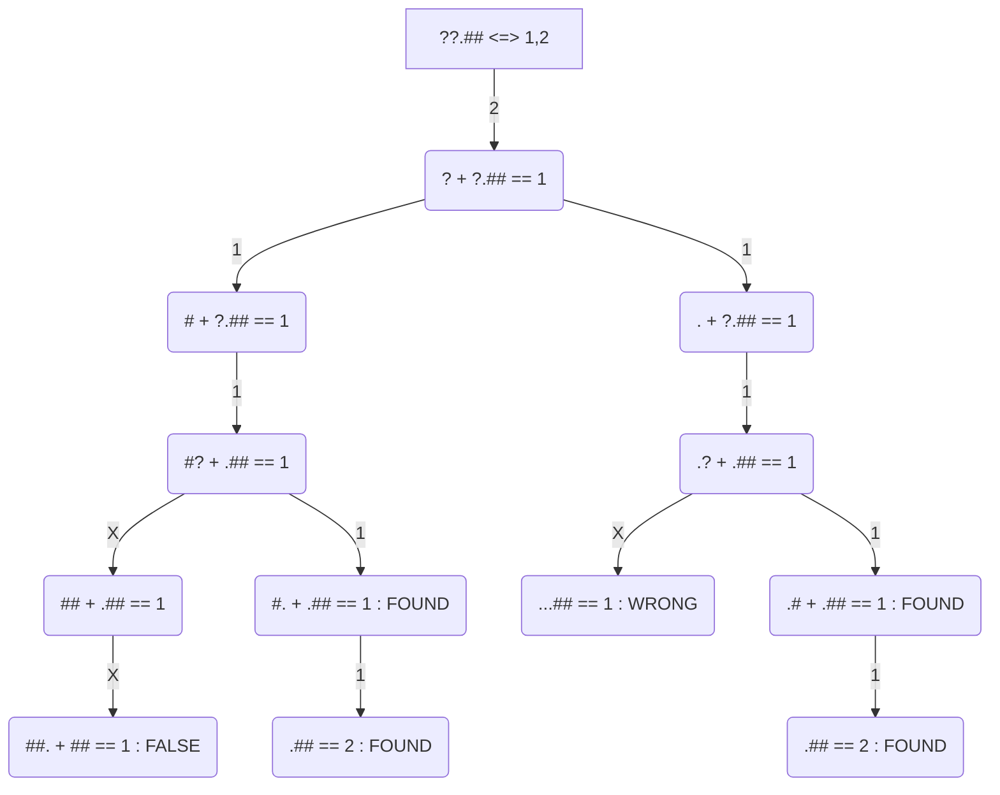

# Day 12: Hot Springs

## Input
Many of the springs have fallen into disrepair. Their condition records of which springs are damaged (your puzzle input) are also damaged! You'll need to help them repair the damaged records.

In the giant field just outside, the springs are arranged into rows. For each row, the condition records show every spring and whether it is operational (.) or damaged (#). This is the part of the condition records that is itself damaged; for some springs, it is simply unknown (?) whether the spring is operational or damaged.

However, the engineer that produced the condition records also duplicated some of this information in a different format! After the list of springs for a given row, the size of each contiguous group of damaged springs is listed in the order those groups appear in the row. This list always accounts for every damaged spring, and each number is the entire size of its contiguous group (that is, groups are always separated by at least one operational spring: #### would always be 4, never 2,2).

However, the condition records are partially damaged; some of the springs' conditions are actually unknown (?). For example:
```
???.### 1,1,3
.??..??...?##. 1,1,3
?#?#?#?#?#?#?#? 1,3,1,6
????.#...#... 4,1,1
????.######..#####. 1,6,5
?###???????? 3,2,1
```
## Part 1
Equipped with this information, it is your job to figure out how many different arrangements of operational and broken springs fit the given criteria in each row

For each row, count all the different arrangements of operational and broken springs that meet the given criteria. What is the sum of those counts?
```
"???.###" <=> [1, 1, 3] => 1 combination
"#.#.###"

".??..??...?##." <=> [1, 1, 3] => 4 combinations
".#...#....###."
".#....#...###."
"..#..#....###."
"..#...#...###."

"?#?#?#?#?#?#?#?" <=> [1, 3, 1, 6] => 1 combination
".#.###.#.######"

"????.#...#..." <=> [4, 1, 1] => 1 combination
"####.#...#..."

"????.######..#####." <=> [1, 6, 5] => 4 combinations
"#....######..#####."
".#...######..#####."
"..#..######..#####."
"...#.######..#####."

"?###????????" <=> [3, 2, 1] => 10 combinations 
".###.##.#..."
".###.##..#.."
".###.##...#."
".###.##....#"
".###..##.#.."
".###..##..#."
".###..##...#"
".###...##.#."
".###...##..#"
".###....##.#"

Total combinations = 21
```
## Part 2
replace the list of spring conditions with five copies of itself (separated by ?) and replace the list of contiguous groups of damaged springs with five copies of itself (separated by ,).
So, this row:
```
.# 1
```
Would become:

```
.#?.#?.#?.#?.# 1,1,1,1,1
```
Unfold your condition records; what is the new sum of possible arrangement counts?

```
     1 = "???.###????.###????.###????.###????.###" <=> [1, 1, 3, 1, 1, 3, 1, 1, 3, 1, 1, 3, 1, 1, 3]
 16384 = ".??..??...?##.?.??..??...?##.?.??..??...?##.?.??..??...?##.?.??..??...?##." <=> [1, 1, 3, 1, 1, 3, 1, 1, 3, 1, 1, 3, 1, 1, 3]
     1 = "?#?#?#?#?#?#?#???#?#?#?#?#?#?#???#?#?#?#?#?#?#???#?#?#?#?#?#?#???#?#?#?#?#?#?#?" <=> [1, 3, 1, 6, 1, 3, 1, 6, 1, 3, 1, 6, 1, 3, 1, 6, 1, 3, 1, 6]
    16 = "????.#...#...?????.#...#...?????.#...#...?????.#...#...?????.#...#..." <=> [4, 1, 1, 4, 1, 1, 4, 1, 1, 4, 1, 1, 4, 1, 1]
  2500 = "????.######..#####.?????.######..#####.?????.######..#####.?????.######..#####.?????.######..#####." <=> [1, 6, 5, 1, 6, 5, 1, 6, 5, 1, 6, 5, 1, 6, 5]
506250 = "?###??????????###??????????###??????????###??????????###????????" <=> [3, 2, 1, 3, 2, 1, 3, 2, 1, 3, 2, 1, 3, 2, 1]
========
525152
```
## Approach
We are looking at the problem in the following way
```
`Hash` rec     `Num` rec     `Hash` rec        `Num` rec
 ===========    ==========    ===========       =============
 "###.#.#" <=> [3, 1, 1]  as  [###], [#], [#] <=> [3], [1], [1]
```
Therefore, a solution to the problem looks like `[###] == [3] AND [#] == [1] AND [#] == [1]`, and therefore, a **"valid combination"**.
In a case of a damaged record `?` we have the possible cases of `.` or `#` hence at that point we have to explore both paths for valid combinations.

 

